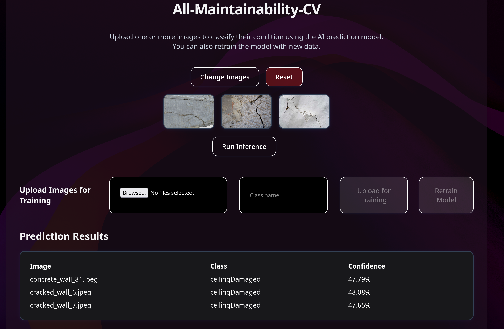
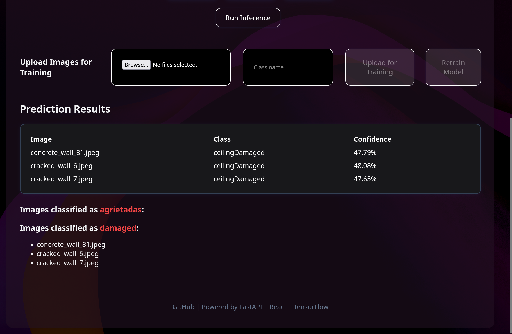
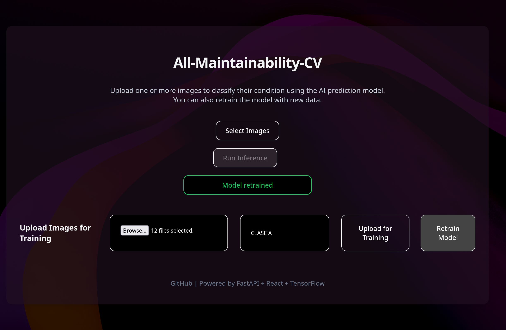

# All Maintainability Computer-Vision
A computer vision project intended to be an alternative to the traditional external structure inspection.

Used image data set: https://drive.google.com/drive/folders/1oMcUj21yA8JCsuyxqMuyp_zMvYK4t34F?usp=sharing

# Previews
[Ver video (RAW GitHub)](https://github.com/labyrinthgarden/All-Maintainability-CV/raw/main/docs/video.mp4)

